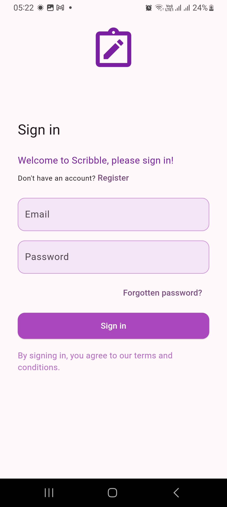
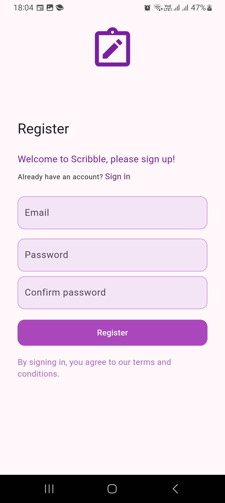
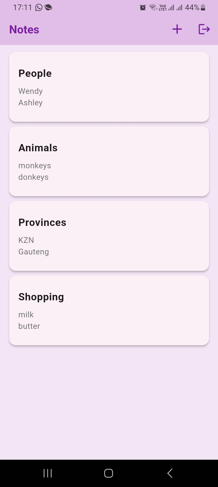
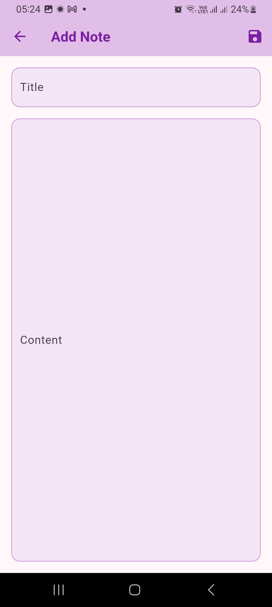

# 📝 Scribble - Flutter Notes App

A modern, beautiful notes application built with Flutter and Firebase. Scribble helps you capture and organize your thoughts with a clean, intuitive interface.

## ✨ Features

* 🔐 **Secure Authentication** - Email/password authentication using Firebase Auth
* 💾 **Cloud Storage** - All notes are automatically synced with Firebase Cloud Firestore
* 🎨 **Beautiful UI** - Clean, modern interface with Material Design 3
* 📱 **Responsive Design** - Works seamlessly on both mobile and tablet devices
* ✏️ **Rich Text Editing** - Full-featured note editor with title and content support
* 🔍 **Quick Access** - Easy to create, edit, and delete notes
* 🌈 **Custom Theme** - Beautiful purple theme with consistent styling

## 📱 Screenshots

<div style="display: flex; justify-content: space-between;">
  
  
  
  
</div>

## 🚀 Getting Started

### Prerequisites

* Flutter (2.0 or higher)
* Firebase account
* Firebase CLI

### Installation

1. Clone the repository
```bash
git clone https://github.com/apillay1992/Scribble.git
```

2. Install dependencies
```bash
flutter pub get
```

3. Configure Firebase
    * Create a new Firebase project
    * Enable Authentication and Cloud Firestore
    * Download and add your `google-services.json` (Android) and `GoogleService-Info.plist` (iOS)
    * Update Firebase configuration in `lib/firebase_options.dart`

4. Run the app
```bash
flutter run
```

## 🏗️ Architecture

The app follows a clean architecture pattern with:

* **Models**: Data classes (`NoteModel`)
* **Repositories**: Data handling layer (`NoteRepository`)
* **ViewModels**: Business logic (`NoteViewModel`)
* **UI**: Presentation layer (`screens`, `widgets`)

## 🛠️ Built With

* [Flutter](https://flutter.dev/) - UI framework
* [Firebase](https://firebase.google.com/) - Backend and Authentication
* [Provider](https://pub.dev/packages/provider) - State Management
* [Cloud Firestore](https://firebase.google.com/products/firestore) - Database

## 📄 License

This project is licensed under the MIT License - see the [LICENSE](LICENSE) file for details.

## 🤝 Contributing

Contributions are welcome! Please feel free to submit a Pull Request.

1. Fork the Project
2. Create your Feature Branch (`git checkout -b feature/AmazingFeature`)
3. Commit your Changes (`git commit -m 'Add some AmazingFeature'`)
4. Push to the Branch (`git push origin feature/AmazingFeature`)
5. Open a Pull Request

## 📞 Contact

Ashley Pillay - @apillay1992

Project Link: https://github.com/apillay1992/Scribble